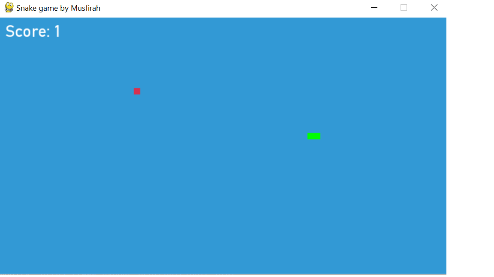

# snake-game-in-python
A simple and fun Snake Game built using Python and Pygame. Control the snake, eat food, and try not to hit the wall or yourself.
# Snake Game in Python

This is a simple and fun Snake Game created using Python and the Pygame library. The goal is to control the snake, eat food, and avoid colliding with the walls or yourself.

## Features
- Classic Snake Gameplay
- Score Tracking
- Game Over Display
- Easy Controls with Arrow Keys

## Technologies Used
- Python
- Pygame

## How to Run
1. Make sure Python is installed on your system.
2. Install the pygame library if not already installed:
pip install pygame
3. Run the game

## screenshot 

## Author
Musfirah _ Learning python and building my first game project!
